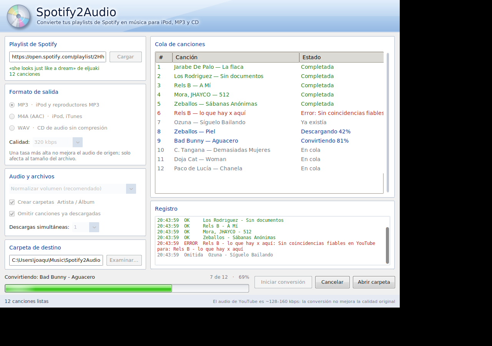
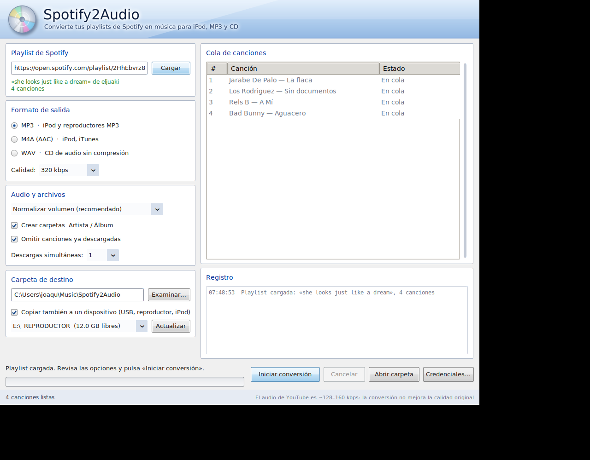
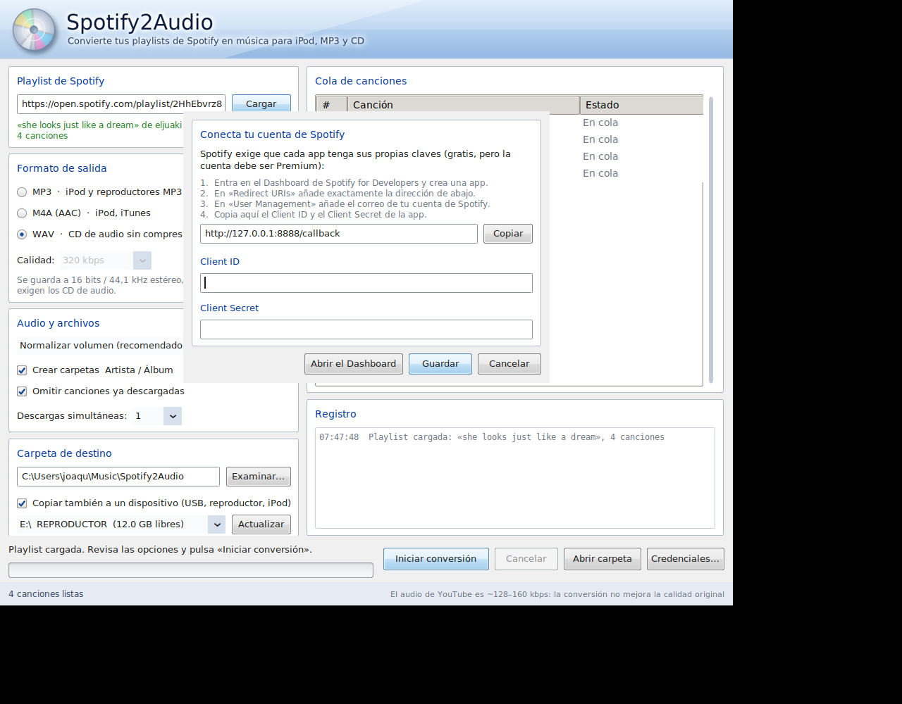

# Spotify2Audio

**Convierte tus playlists de Spotify en archivos de audio etiquetados y organizados, listos para iPod, reproductores MP3 y grabadoras de CD.**

Aplicación de escritorio local para Windows (Python + CustomTkinter) con una interfaz inspirada en Windows Vista / 7. Pegas el enlace de una playlist, eliges formato y carpeta, y el programa se encarga del resto: busca cada canción, descarga el audio, lo convierte, normaliza el volumen, incrusta la portada y las etiquetas, y lo deja ordenado en `Artista/Álbum/01 - Título.mp3`. Opcionalmente lo copia a un USB o reproductor.


<p align="center">
   
</p>

---

## Índice

- [Características](#características)
- [Cómo funciona](#cómo-funciona)
- [Requisitos](#requisitos)
- [Instalación](#instalación)
- [Configurar las credenciales de Spotify](#configurar-las-credenciales-de-spotify)
- [Uso de la interfaz gráfica](#uso-de-la-interfaz-gráfica)
- [Uso desde la línea de comandos](#uso-desde-la-línea-de-comandos)
- [Formatos y calidad de audio](#formatos-y-calidad-de-audio)
- [Copiar a un dispositivo (USB, reproductor, iPod)](#copiar-a-un-dispositivo-usb-reproductor-ipod)
- [Archivos que genera la aplicación](#archivos-que-genera-la-aplicación)
- [Desarrollo por fases](#desarrollo-por-fases)
- [Arquitectura y estructura del proyecto](#arquitectura-y-estructura-del-proyecto)
- [Tests](#tests)
- [Crear el ejecutable (.exe)](#crear-el-ejecutable-exe)
- [Solución de problemas](#solución-de-problemas)
- [Limitaciones conocidas](#limitaciones-conocidas)
- [Aviso legal](#aviso-legal)
- [Créditos](#créditos)
- [Licencia](#licencia)

---

## Características

- **Interfaz gráfica local** con estética Windows Vista / 7 (Aero): cabecera de cristal, botones con brillo y barra de progreso verde. Sin servidores ni nube: todo se ejecuta en tu equipo.
- **Metadatos completos desde Spotify**: título, artistas, álbum, artista del álbum, número de pista y de disco, año, ISRC y portada de alta resolución.
- **Búsqueda inteligente del audio**: puntúa los resultados de YouTube Music y YouTube por duración, título y artista, y penaliza versiones en directo, covers, remixes, karaokes, etc. Verifica la duración real tras descargar y prueba el siguiente candidato si algo no cuadra.
- **Tres formatos de salida**: MP3 (hasta 320 kbps), M4A/AAC y WAV de 16 bits / 44,1 kHz para CD de audio.
- **Normalización de volumen** EBU R128 en dos pasadas (o solo etiquetas ReplayGain), para que todas las canciones suenen al mismo nivel.
- **Etiquetas y portada incrustadas**: ID3v2.3 en UTF-16 para MP3 (la más compatible con iPod) y atoms MP4 para M4A. Portada JPEG *baseline* (los reproductores antiguos no leen JPEG progresivo).
- **Organización automática**: `Destino/Artista/Álbum/01 - Título.ext`, con nombres válidos para Windows, control de la longitud de ruta y numeración multidisco.
- **Robusto**: un fallo en una canción nunca detiene las demás. Se puede cancelar en cualquier momento, no quedan archivos a medias y, al repetir el proceso, solo se reintenta lo que falta.
- **Informes**: `failed_tracks.txt` con el motivo de cada fallo y una lista `.m3u8` en el orden original de la playlist.
- **Copia a dispositivos**: detecta unidades extraíbles y copia de forma segura, con comprobación de espacio y aviso especial para iPods con firmware original.
- **Credenciales desde la propia aplicación**, sin editar archivos a mano.
- **Ejecutable `.exe`** con FFmpeg incluido, para usarlo sin instalar Python.

## Cómo funciona

```mermaid
flowchart LR
    A["URL de la playlist"] --> B["Spotify: metadatos"]
    B --> C["Matcher: YouTube Music / YouTube"]
    C --> D["yt-dlp: descarga el audio"]
    D --> E["FFmpeg: convierte y normaliza"]
    E --> F["mutagen: etiquetas y portada"]
    F --> G["Organizer: Artista / Álbum / 01 - Título"]
    G --> H[("Carpeta de destino")]
    H -.->|opcional| I["USB / reproductor / iPod"]
```



| Etapa | Módulo | Qué hace |
|---|---|---|
| Metadatos | `services/spotify_client.py` | Lee la playlist con la API de Spotify (OAuth) y la convierte en `Track`s. |
| Búsqueda | `services/matcher.py` | Busca candidatos y los puntúa: duración 40 %, título 35 %, artista 25 %, con penalizaciones y bonus. |
| Descarga | `services/downloader.py` | Descarga el mejor audio con `yt-dlp` y verifica la duración real. Prueba hasta 3 candidatos. |
| Conversión | `services/audio_processor.py` | FFmpeg: MP3 / M4A / WAV a 44,1 kHz estéreo y normalización a -14 LUFS. |
| Etiquetado | `services/tagger.py`, `services/cover_fetcher.py` | Incrusta etiquetas y portada (máx. 1000 px). |
| Organización | `services/organizer.py` | Calcula la ruta final y resuelve colisiones. |
| Orquestación | `core/pipeline.py` | Ejecuta todo por pista, con eventos de progreso, cancelación e informes. |
| Dispositivo | `services/device_sync.py` | Detecta unidades extraíbles y copia con archivos temporales. |

## Requisitos

| Requisito | Para qué | Cómo conseguirlo |
|---|---|---|
| Windows 10 / 11 | Plataforma objetivo | El código es multiplataforma, pero solo se ha cuidado y probado para Windows. |
| Python 3.10 o superior | Ejecutar desde el código fuente | [python.org](https://www.python.org) (marca *Add to PATH*). No hace falta con el `.exe`. |
| **FFmpeg** (con `ffprobe`) | Convertir y normalizar | `winget install Gyan.FFmpeg` |
| **Deno** | `yt-dlp` lo necesita para YouTube desde nov-2025 | `winget install DenoLand.Deno` |
| Cuenta de **Spotify Premium** | Requisito de Spotify para crear la app de desarrollador | [Dashboard de Spotify](https://developer.spotify.com/dashboard) |

## Instalación
Puedes copiar el script paso por paso tal y como aparece:
```powershell
# 1. Clonar el repositorio
git clone https://github.com/JoaquinRuizJimenez/spotify2audio.git
cd spotify2audio

# 2. Herramientas externas (cierra y reabre la terminal después)
winget install Gyan.FFmpeg
winget install DenoLand.Deno

# 3. Entorno virtual y dependencias
python -m venv .venv
.\.venv\Scripts\Activate.ps1
pip install -r requirements.txt
pip install -e .
```

> Si PowerShell bloquea la activación del entorno: `Set-ExecutionPolicy -Scope CurrentUser RemoteSigned`.
>
> Si prefieres no instalar FFmpeg en el sistema, copia `ffmpeg.exe` y `ffprobe.exe` en la carpeta `bin/` del proyecto. Lo mismo vale para `deno.exe`.
>
> OJO. `bin/` es un directorio de Linux, no de Windows. Yo ya tenia ffmpeg instalado y no iba a borrarlo todo para probar. Instalalo. Es lo que más he testeado y lo que se seguro que funciona. En Windows imagino que seria en `C:\Windows\System32`, pero no puedo confirmar.

Comprueba que todo está bien:

```powershell
python -m spotify2audio --check   # FFmpeg, Deno y credenciales
pytest                            # tests
```
> OJO. Hay `2` test que en Windows no pasan. Es normal. Es una cuestion de rutas (rutas de Linux en lugar de Windows). Intenté solucionarlo y solo me di cabezazos contra el teclado durante 30 minutos, asi que lo deje asi.

## Configurar las credenciales de Spotify

Spotify exige que cada aplicación use sus propias claves (gratuitas, pero con cuenta Premium):

1. Entra en el [Dashboard de Spotify for Developers](https://developer.spotify.com/dashboard) y crea una app con acceso a la **Web API**.
2. En **Redirect URIs** añade exactamente: `http://127.0.0.1:8888/callback` (es `127.0.0.1`, no `localhost`).
3. En **User Management** añade el correo de tu cuenta de Spotify.
4. Copia el **Client ID** y el **Client Secret**.

Hay tres formas de indicárselos a la aplicación (en este orden de prioridad):

| Método | Cómo |
|---|---|
| **Desde la interfaz** (recomendado) | Botón **Credenciales…**. Se guardan en el Administrador de credenciales de Windows, o en un `.env` de la carpeta de configuración si no está disponible. El diálogo se abre solo si faltan al pulsar *Cargar*. |
| Archivo `.env` | Copia `.env.example` a `.env` (en la carpeta del proyecto, junto al `.exe` o en la carpeta de configuración) y rellénalo. |
| Variables de entorno | `SPOTIFY_CLIENT_ID`, `SPOTIFY_CLIENT_SECRET` y, opcionalmente, `SPOTIFY_REDIRECT_URI`. |

La primera vez que cargues una playlist se abrirá el navegador para autorizar la aplicación. El token queda guardado.

> **Importante: solo se pueden leer playlists tuyas o colaborativas.** Desde febrero de 2026, las apps de Spotify en *Development Mode* solo reciben el contenido de playlists de las que el usuario es dueño o colaborador. No se pueden cargar playlists públicas de otras personas ni las generadas por Spotify. Además, el modo desarrollo limita el número de usuarios autorizados (5 según la documentación de Spotify en el momento de escribir esto; puede cambiar).

## Uso de la interfaz gráfica

```powershell
python -m spotify2audio
```

También puedes hacer doble clic en `Spotify2Audio.bat` (abre la aplicación sin ventana de consola).

1. Pega el enlace de tu playlist y pulsa **Cargar**.
2. Elige el **formato** (MP3, M4A o WAV), la calidad, la normalización y la **carpeta de destino**.
3. Opcional: marca **Copiar también a un dispositivo** y elige la unidad. **ACLARACION**
No tengo un ipod, lo que significa que no he podido testear esto manualmente. Igualmente deberia funcionar
4. Pulsa **Iniciar conversión**. Verás la canción actual y su etapa (*Buscando, Descargando, Convirtiendo, Etiquetando*), el progreso global y el registro en tiempo real.
5. Puedes **Cancelar** cuando quieras. Al terminar se muestra un resumen.

<p align="center">
  
</p>

Tus opciones y la última URL se guardan al cerrar. Si alguna canción falla, el motivo aparece en la cola, en el registro y en `failed_tracks.txt`; vuelve a pulsar *Iniciar conversión* para reintentar solo las que faltan.

<p align="center">
  
</p>

## Uso desde la línea de comandos

El mismo motor está disponible por consola, útil para probar y para automatizar:

```powershell
python -m spotify2audio.cli "URL_DE_LA_PLAYLIST" [opciones]
```

| Opción | Descripción |
|---|---|
| *(sin opciones)* | Muestra la playlist y sus canciones. |
| `--limit N` | Cuántas canciones listar (`0` = todas). Por defecto 15. |
| `--match N` | Muestra los candidatos de YouTube y sus puntuaciones para las N primeras (no descarga). |
| `--download N` | Descarga el audio crudo de las N primeras en la carpeta de `--out`. |
| `--process N` | Pipeline completo con las N primeras canciones. |
| `--run` | Pipeline completo con **toda** la playlist. |
| `--format mp3\|m4a\|wav` | Formato de salida. |
| `--normalize loudnorm\|replaygain\|none` | Modo de normalización de volumen. |
| `--workers N` | Canciones en paralelo (1-8). Con más de 3 YouTube puede limitar las descargas. |
| `--no-skip` | Rehace las canciones aunque el archivo ya exista. |
| `--out CARPETA` | Carpeta de salida (por defecto `_test_downloads`). |

Ejemplos:

```powershell
# Playlist entera, 2 canciones en paralelo, a una carpeta concreta:
python -m spotify2audio.cli "URL" --run --workers 2 --out "D:\Musica\MiPlaylist"

# Playlist entera en WAV para grabar un CD:
python -m spotify2audio.cli "URL" --run --format wav --out .\cd
```

`Ctrl+C` cancela de forma limpia: termina la operación en curso, borra los temporales y conserva lo ya completado.

## Formatos y calidad de audio

| Formato | Pensado para | Detalles |
|---|---|---|
| **MP3** | iPod, reproductores MP3, coche | `libmp3lame`, 128 / 192 / 256 / 320 kbps. ID3v2.3 con portada. |
| **M4A (AAC)** | iPod, iTunes / Apple Music | AAC en contenedor MP4, mismas tasas. |
| **WAV** | Grabar CD de audio | PCM 16 bits, 44,1 kHz, estéreo. Sin etiquetas por defecto (los grabadores las ignoran). |

**Normalización de volumen** (por defecto: `loudnorm`)

- `loudnorm`: modifica el audio con EBU R128 en dos pasadas (objetivo -14 LUFS, pico real máximo -1,5 dB). Funciona en cualquier reproductor, también en iPods y CD.
- `replaygain`: no toca el audio, solo escribe las etiquetas. Muchos reproductores sencillos las ignoran. No es compatible con WAV.
- `none`: sin normalizar.

> **Sobre la calidad real.** El audio de origen viene de YouTube (Opus/AAC de unos 128-160 kbps). Convertirlo a MP3 de 320 kbps o a WAV **no mejora la calidad**: solo cambia el contenedor y el tamaño del archivo. Lo que sí garantiza es la compatibilidad con tu dispositivo.

## Copiar a un dispositivo (USB, reproductor, iPod)

Marca **«Copiar también a un dispositivo»** y elige la unidad en la lista (pulsa *Actualizar* si la conectaste después). Las canciones se procesan siempre en la carpeta de destino y, al terminar, se copian a `<unidad>\Music\Artista\Álbum\…` junto con la lista `.m3u8`.

- **Copia segura**: escribe en un archivo temporal y lo renombra al terminar, así no quedan archivos a medias si se desconecta. Omite lo que ya está en el dispositivo y comprueba el espacio libre antes de empezar.
- Si el dispositivo falla, las canciones locales no se pierden. Si deja de responder tras 3 fallos seguidos, la copia se detiene.
- Solo se listan unidades **extraíbles**. Un disco duro USB que Windows trate como «fijo» no aparece: usa *Examinar…* y elígelo directamente como carpeta de destino.
- **iPod con firmware original de Apple**: solo muestra la música registrada en su base de datos, así que los archivos copiados directamente **no aparecerán en su menú**. La aplicación te avisa antes de empezar. Opciones: instalar [Rockbox](https://www.rockbox.org) en el iPod, o añadir la carpeta de destino a iTunes / la app Música y sincronizar desde ahí.
- Expulsa siempre la unidad con «Quitar hardware de forma segura» antes de desconectarla.

## Archivos que genera la aplicación

En la **carpeta de destino**:

| Archivo | Contenido |
|---|---|
| `Artista/Álbum/01 - Título.ext` | Las canciones, etiquetadas y con portada. |
| `<Nombre de la playlist>.m3u8` | Lista de reproducción con rutas relativas, en el orden de Spotify. |
| `failed_tracks.txt` | Canciones fallidas con el motivo y su enlace de Spotify. Se elimina solo cuando un reintento lo deja todo bien. |

En `%LOCALAPPDATA%\Spotify2Audio` (configuración, caché y registros):

| Archivo | Contenido |
|---|---|
| `settings.json` | Tus preferencias (no incluye credenciales). |
| `spotify_token.json` | Token de autorización de Spotify. |
| `Logs\spotify2audio.log` | Registro detallado, útil para diagnosticar problemas. |
| `Cache\` | Portadas descargadas y carpetas de trabajo temporales. |

## Desarrollo por fases

El proyecto se construyó en siete fases. Cada una añade una capa que se puede probar de forma independiente, y todas siguen disponibles desde la consola.

| Fase | Contenido | Estado |
|---|---|---|
| 1 | Esqueleto, modelos, errores, configuración, comprobación del entorno | Completada |
| 2 | Cliente de Spotify (OAuth, paginación, portadas) | Completada |
| 3 | Búsqueda de candidatos y descarga con `yt-dlp` | Completada |
| 4 | Conversión, normalización, etiquetas, portada y organización | Completada |
| 5 | Pipeline: errores por pista, cancelación, informes, paralelismo | Completada |
| 6 | Interfaz gráfica estilo Windows Vista / 7 | Completada |
| 7 | Copia a dispositivos, credenciales en la app y empaquetado `.exe` | Completada |

<details>
<summary><b>Fase 1 — Esqueleto y entorno</b></summary>

Modelos de datos (`Track`, `Playlist`, `JobOptions`, `TrackResult`, `JobSummary`), jerarquía de errores propia, configuración persistente, nombres de archivo seguros para Windows, registro de eventos y comprobación de FFmpeg.

```powershell
python -m spotify2audio --check
pytest
```

Salida esperada: `FFmpeg OK`, `Credenciales de Spotify OK` y la carpeta de salida configurada.
</details>

<details>
<summary><b>Fase 2 — Cliente de Spotify</b></summary>

Lee una playlist (URL, URI `spotify:playlist:…` o ID) con paginación, selecciona la portada de mayor resolución y traduce los errores de la API (401, 403, 404, 429) a mensajes claros.

```powershell
python -m spotify2audio.cli "https://open.spotify.com/playlist/TU_ID"
```

La primera vez se abre el navegador para autorizar la app; el token queda guardado.
</details>

<details>
<summary><b>Fase 3 — Búsqueda y descarga</b></summary>

Busca candidatos en YouTube Music y YouTube, los puntúa y descarga el audio crudo (normalmente `.webm`) con `yt-dlp`.

```powershell
# Solo buscar candidatos para las 5 primeras pistas (no descarga):
python -m spotify2audio.cli "URL" --limit 0 --match 5
# Descargar el audio crudo de las 3 primeras a ./_test_downloads:
python -m spotify2audio.cli "URL" --download 3
```

Cada candidato muestra su puntuación y el motivo (por ejemplo, `duración Δ1s / título 1.00 / artista 1.00`).
</details>

<details>
<summary><b>Fase 4 — Conversión, etiquetas y organización</b></summary>

Convierte con FFmpeg, normaliza el volumen, incrusta etiquetas y portada, y coloca cada archivo en su carpeta.

```powershell
# 2 pistas a MP3 320 kbps con normalización de volumen:
python -m spotify2audio.cli "URL" --limit 0 --process 2 --out .\prueba_mp3
# Mismo contenido en M4A, o WAV para CD:
python -m spotify2audio.cli "URL" --limit 0 --process 2 --format m4a --out .\prueba_m4a
python -m spotify2audio.cli "URL" --limit 0 --process 2 --format wav --out .\prueba_cd
# Sin normalizar / solo etiquetas ReplayGain:
python -m spotify2audio.cli "URL" --limit 0 --process 2 --normalize none
```

Resultado: `Destino/Artista/Álbum/01 - Título.ext`, con etiquetas y portada incrustadas. Si repites el comando, las pistas ya existentes se omiten.
</details>

<details>
<summary><b>Fase 5 — Pipeline completo</b></summary>

Orquesta todas las etapas con manejo de errores por pista, cancelación limpia, comprobación de espacio, paralelismo opcional e informes.

```powershell
# Playlist entera (Ctrl+C cancela de forma limpia):
python -m spotify2audio.cli "URL" --run --out "D:\Musica\MiPlaylist"
# Con 3 pistas en paralelo y WAV para CD:
python -m spotify2audio.cli "URL" --run --workers 3 --format wav --out .\cd
```

Al terminar, en la carpeta de salida:

- `failed_tracks.txt`: pistas fallidas con el motivo y su enlace de Spotify. Repite el mismo comando para reintentar solo esas.
- `<Nombre de la playlist>.m3u8`: lista de reproducción con rutas relativas, en el orden de Spotify.
</details>

<details>
<summary><b>Fase 6 — Interfaz gráfica</b></summary>

Ventana de CustomTkinter con widgets propios dibujados con Pillow (botones, radios, casillas y barra de progreso estilo Aero).

```powershell
python -m spotify2audio          # abre la aplicación
python -m spotify2audio --check  # solo comprueba FFmpeg, Deno y credenciales
```

También puedes hacer doble clic en `Spotify2Audio.bat` (sin ventana de consola).

Flujo: pega el enlace → **Cargar** → elige formato y carpeta → **Iniciar conversión**. Tus opciones y la última URL se guardan al cerrar. Si algo falla, el motivo aparece en la cola, en el registro y en `failed_tracks.txt`.

Tests de la ventana real (opcionales; abren una ventana unos segundos):

```powershell
$env:S2A_GUI_TESTS = "1"; pytest tests/test_gui_smoke.py
```
</details>

<details>
<summary><b>Fase 7 — Dispositivos, credenciales y ejecutable</b></summary>

- Detección de unidades extraíbles y copia segura (ver [Copiar a un dispositivo](#copiar-a-un-dispositivo-usb-reproductor-ipod)).
- Diálogo de credenciales de Spotify dentro de la aplicación (ver [Configurar las credenciales](#configurar-las-credenciales-de-spotify)).
- Empaquetado en `.exe` con PyInstaller (ver [Crear el ejecutable](#crear-el-ejecutable-exe)).
</details>

## Arquitectura y estructura del proyecto

Arquitectura en capas con un núcleo independiente de la interfaz. La GUI solo presenta y delega: se comunica con el pipeline mediante eventos y una cola, porque el trabajo pesado corre en hilos de fondo. Por eso el mismo motor sirve para la ventana y para la consola.

```
spotify2audio/
├── README.md
├── pyproject.toml
├── requirements.txt            # dependencias de ejecución y tests
├── requirements-build.txt      # PyInstaller
├── .env.example                # plantilla de credenciales
├── Spotify2Audio.bat           # lanzador sin consola
├── bin/                        # ffmpeg / ffprobe / deno opcionales
├── packaging/
│   ├── launcher.py             # punto de entrada del .exe
│   └── spotify2audio.spec      # configuración de PyInstaller
├── scripts/
│   └── build_exe.py            # genera el ejecutable
├── src/spotify2audio/
│   ├── __main__.py             # abre la GUI (o --check)
│   ├── cli.py                  # interfaz de línea de comandos
│   ├── config/                 # settings.json, rutas, credenciales
│   ├── models/                 # Track, Playlist, JobOptions, resultados
│   ├── services/               # spotify_client, matcher, downloader, audio_processor,
│   │                           # cover_fetcher, tagger, organizer, device_sync
│   ├── core/                   # pipeline, eventos, errores, cancelación
│   ├── gui/                    # app, widgets Aero, controlador, diálogo de credenciales
│   └── utils/                  # sanitize, retry, logging, FFmpeg/Deno, espacio en disco
└── tests/
```

**Jerarquía de errores** (`core/errors.py`): `AppError` → `SpotifyError`, `MatchNotFoundError`, `DownloadError`, `ProcessingError`, `TaggingError`, `DeviceError`, `DependencyMissingError`, `CancelledError`. El pipeline captura los errores por pista, los registra y continúa con el resto.

## Tests

```powershell
pytest
```

Más de cien tests que cubren el emparejamiento de canciones, la sanitización de nombres, el pipeline (fallos, cancelación, reintentos, paralelismo), la copia a dispositivos, las credenciales y la lógica de la interfaz.

- Los tests de audio usan **FFmpeg real**. Si no está instalado, se omiten automáticamente (aparecen como *skipped*).
- Los tests de la **ventana real** se omiten salvo que definas `S2A_GUI_TESTS=1` (en Linux se ejecutan con `xvfb-run`).
- No hacen falta credenciales ni conexión: Spotify, YouTube y las unidades se simulan.

## Crear el ejecutable (.exe)

```powershell
pip install -r requirements-build.txt
python scripts/build_exe.py --fetch-tools --zip
```

- `--fetch-tools` copia `ffmpeg`, `ffprobe` y `deno` desde tu `PATH` a `bin/` (si no, cópialos a mano).
- El resultado queda en `dist\Spotify2Audio\` (ejecutable: `Spotify2Audio.exe`) y, con `--zip`, en un `.zip` listo para compartir.
- Se genera una **carpeta** (no un único archivo): arranca más rápido y los antivirus lo marcan menos.
- Quien use el `.exe` no necesita Python, pero sí sus propias credenciales de Spotify (se piden desde la aplicación).

Notas para distribuirlo:

- Windows SmartScreen o el antivirus pueden avisar la primera vez porque el programa no está firmado digitalmente.
- Incluir FFmpeg en lo que compartas implica cumplir su licencia (las compilaciones de Gyan son GPL).
- Cada persona necesita su cuenta de Spotify Premium para crear sus claves, o ser añadida en tu Dashboard (con el límite de usuarios del modo desarrollo).

## Solución de problemas

| Síntoma | Causa probable y solución |
|---|---|
| `FFmpeg no encontrado` | No está instalado o la terminal no ha recargado el `PATH`. Instálalo con `winget install Gyan.FFmpeg` y **cierra y reabre la terminal** (y VS Code, si lo usas). Sin reiniciar: `$env:Path = [Environment]::GetEnvironmentVariable("Path","Machine") + ";" + [Environment]::GetEnvironmentVariable("Path","User")`. También puedes copiar `ffmpeg.exe` y `ffprobe.exe` en `bin/`. |
| Tests de audio *skipped* | Es lo mismo: `pytest` no encuentra FFmpeg. Al instalarlo dejan de omitirse. |
| `403` al cargar la playlist | La playlist no es tuya ni colaborativa, tu cuenta no está en *User Management* del Dashboard, o el dueño de la app no tiene Premium. |
| `INVALID_CLIENT: Invalid redirect URI` | La Redirect URI del Dashboard no coincide carácter por carácter con `http://127.0.0.1:8888/callback` (o con tu `SPOTIFY_REDIRECT_URI`). |
| `404` al cargar | URL mal copiada, o playlist privada de otra persona. |
| Se abre el diálogo de credenciales | Faltan el Client ID o el Secret. Rellénalos y vuelve a pulsar *Cargar*. |
| Cambié de credenciales y falla el login | Se borra el token antiguo al guardar. Si persiste, elimina `spotify_token.json` de `%LOCALAPPDATA%\Spotify2Audio`. |
| Todas las canciones fallan con `challenge` o `JavaScript runtime` | Falta Deno o no está en el `PATH`: `winget install DenoLand.Deno`. |
| `Sign in to confirm you're not a bot` | YouTube pide verificación o tu `yt-dlp` está desactualizado: `pip install -U "yt-dlp[default]"`. Si usas varios hilos, baja a 1 o 2 `Descargas simultáneas`. |
| `Sin coincidencias fiables en YouTube` | Ninguna versión superó el umbral (canción poco conocida o duración muy distinta). Usa `--match` para ver los candidatos y sus puntuaciones. |
| Una canción es una versión equivocada (directo, remix…) | El programa no puede detectarlo con certeza. Borra ese archivo y repite; si ocurre a menudo, abre un *issue* con el artista y el título. |
| El iPod no muestra las canciones copiadas | Firmware original de Apple. Instala Rockbox o sincroniza la carpeta con iTunes / app Música. |
| Mi USB no aparece en la lista | Windows solo lo marca como extraíble en algunos casos. Pulsa *Actualizar*; si no sale, usa *Examinar…* y elígelo como carpeta de destino. |
| `PowerShell` no deja activar el entorno virtual | `Set-ExecutionPolicy -Scope CurrentUser RemoteSigned`. |
| El `.exe` es bloqueado | SmartScreen o el antivirus por no estar firmado. Permítelo manualmente si confías en la compilación. |

Si algo más falla, revisa `%LOCALAPPDATA%\Spotify2Audio\Logs\spotify2audio.log` y adjunta las líneas relevantes al abrir un *issue*.

## Limitaciones conocidas

- Solo se pueden leer **playlists propias o colaborativas** (restricción de Spotify en *Development Mode*), y el modo desarrollo limita los usuarios autorizados.
- El audio proviene de YouTube, así que la calidad máxima es la de su origen (≈128-160 kbps).
- La elección de la versión correcta de cada canción es heurística: puede equivocarse en canciones poco conocidas.
- Los iPods con firmware original no muestran música copiada directamente.
- Solo se listan las unidades que Windows marca como extraíbles.
- El `.exe` no está firmado digitalmente.
- No se aceptan todavía enlaces de álbumes o canciones sueltas, ni enlaces cortos (`spotify.link`).

## Aviso legal

Este proyecto es una herramienta personal con fines educativos y **no está afiliado, respaldado ni patrocinado por Spotify, YouTube, Google ni Apple**; los nombres pertenecen a sus respectivos propietarios.

Descargar audio de YouTube y de contenido protegido puede infringir los términos de servicio de esas plataformas y, según tu país, la legislación sobre derechos de autor. **El uso que hagas del programa es responsabilidad exclusiva tuya.** Úsalo solo con contenido sobre el que tengas derecho a hacer copias y, si piensas distribuirlo, consulta antes a un profesional del derecho.

## Créditos

Construido sobre estos proyectos de código abierto:

- [spotipy](https://github.com/spotipy-dev/spotipy): cliente de la API de Spotify.
- [yt-dlp](https://github.com/yt-dlp/yt-dlp): búsqueda y descarga de audio.
- [FFmpeg](https://ffmpeg.org): conversión y normalización.
- [mutagen](https://github.com/quodlibet/mutagen): etiquetas ID3 y MP4.
- [CustomTkinter](https://github.com/TomSchimansky/CustomTkinter) y [Pillow](https://python-pillow.org): interfaz gráfica.
- [psutil](https://github.com/giampaolo/psutil), [platformdirs](https://github.com/platformdirs/platformdirs), [keyring](https://github.com/jaraco/keyring), [python-dotenv](https://github.com/theskumar/python-dotenv) y [PyInstaller](https://pyinstaller.org).
- Vibecoded con Claude Sonnet 5.5 Mid
